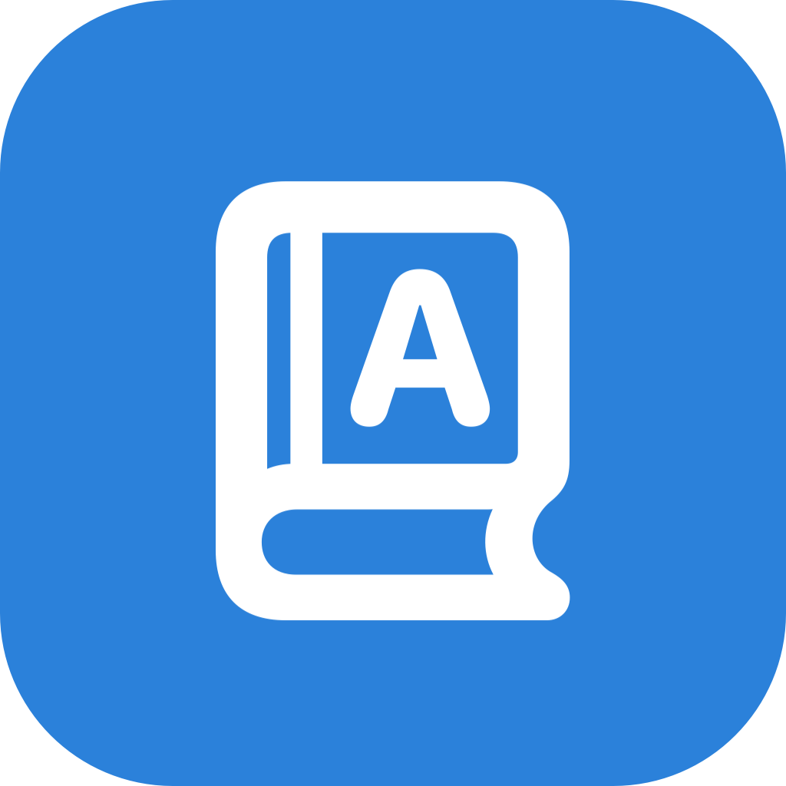

# macos-wordbar



macOS 菜单栏背单词小工具 — 单词常驻顶部状态栏，记住了点 `✓` 换下一个，利用碎片时间被动刷词。

原生 Swift + AppKit 实现，单文件源码，无第三方依赖，无需 Xcode。

[English README](README.md)

## 功能

- **菜单栏常驻**：`单词 ✓` 一体显示，不占 Dock
- **点 `✓`**：标记为已记住并换下一个词
- **点单词**：弹出菜单 — 音标/释义/例句/翻译，以及 Memorized / Previous / Next / Unmark / 朗读 等操作
- **浏览词库**：浮动面板列出全部单词，自动定位到当前词——背过的行带 `✓`，双击某行直接跳到该词
- **菜单栏显示释义/例句**：可开关，超长内容支持横向滑动
- **TTS 朗读**：macOS 原生 `AVSpeechSynthesizer`，离线可用
- **顺序背词**：按词库顺序推进，已记住的自动跳过，跳过的词走满一圈会再出现
- **进度持久化**：已记单词写入 `memorized.txt`，重启不丢
- **多词库切换**：菜单 Vocabulary 子菜单里可切换 `~/.config/wordbar` 下任意 `.txt` 词库，或 Choose File… 选任意位置的词表，选择会记住
- **词库热重载**：编辑当前词库文件保存后自动刷新
- **Anki 导入**：`scripts/apkg2words.py` 可把 `.apkg` 牌组转成词库

## 构建与运行

```bash
./build.sh        # 编译打包成 WordBar.app
open WordBar.app  # 启动，出现在菜单栏
```

要求：macOS 13+，装有 Xcode Command Line Tools（`swiftc`）。

## 词库格式

当前词库文件（默认 `~/.config/wordbar/words.txt`，可在 Vocabulary 子菜单里换成任意 `.txt`），每行一个：

```text
abandon|[əˈbændən] v. 放弃；抛弃|Those who abandon themselves to despair can not succeed.|那些自暴自弃的人无法成功。
```

即 `单词|释义|例句|例句翻译`，后两列可选。也兼容 `单词|释义`、Tab 分隔、`单词 - 释义`、`单词,释义`、纯单词行；`#` 开头为注释。

进度文件：`~/.config/wordbar/memorized.txt`（已记住的单词）。

现成的四级词库（4027 词，含音标、词性、英汉对照例句）在 `data/cet4-words.txt`，复制过去即可使用。`scripts/apkg2words.py` 也能把 Anki `.apkg` 牌组转成这个格式（用法见脚本内的文档字符串）。

## 菜单栏操作一览

| 区域 | 操作 |
|---|---|
| `✓` | 记住了，换下一个 |
| 单词（左/右键） | 弹出菜单 |
| 菜单栏文字 | 超长时触控板/滚轮横向滑动 |
| Cmd + 拖动 | 拖出菜单栏即退出 |

## 项目结构

```text
macos-wordbar/
├── main.swift              # 全部 App 源码（单文件）
├── Info.plist              # Bundle 配置（LSUIElement，无 Dock 图标）
├── build.sh                # 编译 + 打包 + 签名脚本
├── AppIcon.icns / icon.png # 应用图标
├── data/                   # 词库数据（.apkg 牌组只在本地，不入库）
│   └── cet4-words.txt      #   转换好的四级词库（4027 词）
└── scripts/
    ├── apkg2words.py       #   Anki .apkg -> words.txt 转换器
    └── gen_icon.swift      #   图标生成脚本
```

## License

MIT
